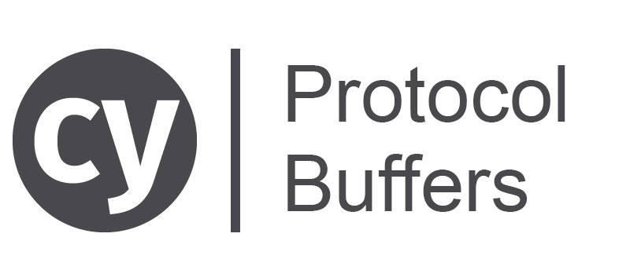

# cypress-protobuf
Encode a fixture with Protocol Buffers



Use this plugin to encode with [Protocol Buffers](https://developers.google.com/protocol-buffers/) a Cypress fixture.

# Installation
```bash
npm i -D cypress-protobuf
# or
yarn add -D cypress-protobuf
```

then open your `cypress/plugins/index.js` file and register a new task
```javascript
module.exports = on => {
  on("task", {
    protobufEncode: require("cypress-protobuf"),
  });
};
```

# How to use it
To encode with Protocl Buffers a fixture
```javascript
cy.fixture("usb-key/status_one_usb_key.json")
  .then(json => {
    cy.task("protobufEncode", {
      fixtureBody: json, // the fixture body
      message: "Status", // the protobuf message to use
      protoFilePath: "./public/ui.proto", // the path (starting from your project directory) to the .profo file
    })
  .then(encodedJson => {
    // 🎉 `encodedJson` contains the encoded fixture
    cy.route({
      headers: {
        "content-type": "application/octet-stream"
      },
      response: encodedJson,
      url: 'API_URL'
    }).as("YOUR_FIXTURE_NAME");
  });
});
```

and in your test you will wait for the request as usual
```javascript
cy.wait("@YOUR_FIXTURE_NAME");
```

# Tips
- the plugin saves the last `protoFilePath` so you can avoid to pass it every time. You can even set it at the beginning of your test suite
```javascript
before(() => {
  cy.task("protobufEncode", {
    protoFilePath: "./public/escrow/ui.proto"
  });
});
```
<br /><br /><br /><br />
features

- save the last proto file path
- allow to set the proto file path in advance
TODO
- add a cypress example
- add travis
- add badges
- spread it (to the cypress plugin list too)
